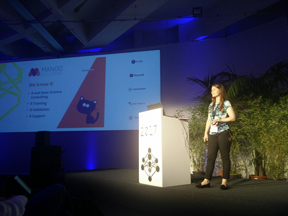
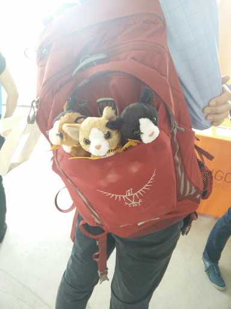

# useR!2017 Recap

Last week saw the R community come together in Brussels for the annual useR! conference. Previously we wrote a recap of [day 2](https://www.mango-solutions.com/blog/user-2017-day2-recap) and [day 3](https://www.mango-solutions.com/blog/user-2017-day3-recap) (see also the recaps of [eoda](http://blog.eoda.de/2017/07/12/die-user2017-unser-fazit/) and [DataCamp](https://www.datacamp.com/community/blog/user-2017-in-retrospect)). In this post we will recap day 4 and also give our overall impression of the conference.

## Day 4 - The Final Day

The conference dinner was on the night of day 3 so you're forgiven if you didn't attend the keynote on day 4. Nevertheless, Isabella Gollini did a great job of presenting on her work with the latentnet and lvm4net packages. The examples of its succesful use in tackling human trafficking helped us understand these network analysis tools better.

Following the keynote there were 4 sessions packed with very good talks. We saw Lionel Henry present on the new way of programming within the tidyverse called Tidy Evaluation. It introduced us to the _bang bang_ operator and David Robinson had a lot of fun with that ([tweet](https://twitter.com/drob/status/883252620730654720), [tweet](https://twitter.com/drob/status/883253686931144705) and [tweet](https://twitter.com/drob/status/883256657853112320)). As avid package developers tidy evaluation will definitely change the way we program and we look forward to using it.
Meanwhile in the plenary room, Patricia Martinkova presented her shiny application called ShinyItemAnalysis. The purpose of ShinyItemAnalysis is to provide a psychometric analysis of educational tests and their items. We agree with Patricia in that this tool is something anyone developing tests should be using. The package is available on [CRAN](https://cran.r-project.org/web/packages/ShinyItemAnalysis/index.html) if you want more information.

If you like Shiny then you would have probably enjoyed all the sessions in the plenary room. After Patricia's talk, Nick Strayer presented on [shinysense](https://github.com/nstrayer/shinysense). His package allows you to use shiny functionality to collect data from sensors. It is a work in progress but currently it is able to collect data from iphones (touch, audio, camera, accelerometer). Nick's objective with shinysense is to expand the range of use of Shiny from only presenting analysis results to collecting data. If you're wondering when this would be useful look no further than Lucy McGowan's talk on the papr app. Presented as a "Tinder-like app for pre-prints of scientific papers", papr uses the touch functionality from shinysense. The app allows you to rate scientific papers by swiping to the left or right. This may sound simple but Lucy's talk showed that there was more to it, from placing data in Dropbox to building a recommender engine. It's definitely worth [checking out](https://jhubiostatistics.shinyapps.io/papr/) if you're into swiping. 

The presentations in the other rooms were just as interesting as the Shiny ones. Tomas Kalibera presented on using the byte compiler to increase performance. Most of us probably have never heard of the byte compiler but it essentially allows you to optimize your code for a specific platform. Tomas gave some great tips and tricks for taking advantage of the byte compiler. It is an advanced topic but if you're interested we recommend Colin Gillespie's [book](https://bookdown.org/csgillespie/efficientR/) on writing efficient R code (Colin also gave a workshop on this topic on day  2).

Another interesting talk came from Mark van der Loo about the [simputation](https://github.com/markvanderloo/simputation) package. With simputation you can  impute missing values in a data frame using various methods. Coincidently, Steffen Moritz also presented on imputing missing values with his [ImputeTS](https://cran.r-project.org/web/packages/imputeTS/index.html) package. Steffen had an interesting slide showing the landscape of packages that perform imputation. What simputation adds to this landscape is ease of use, whereas the imputeTS package is mainly for (univariate) time series.

The day ended with a presentation by Uwe Ligges on 20 years of CRAN. Many of us may not think about what goes on behind the scenes of CRAN but Uwe carefully explained how CRAN has evolved over time. It was interesting to see how the efforts of just a few pioneers produced something that now hosts more than 10.000 packages. That is both a blessing and a curse as CRAN is becoming increasingly difficult to maintain. Uwe stressed that if we want CRAN to continue to be a success we must change the way we maintain it and the way we submit/write packages. 

## Overall

For some of us this was the first useR! conference and having been at business conferences before we are definitely impressed by the community. To the credit of the organisation, there was a feeling of inclusion and cooperation right from the start. Nowhere else have we experienced the breadth of topics as in Brussels and nowhere else have we felt the curiosity with which attendees explore the R universe. 

If you missed useR! this year here are some presentations we recommend to watch (once the recordings become available):

* Norm Matloff - Parallel Computation in R:  What We Want, and How We (Might) Get It
* Mine Cetinkaya-Rundel - Teaching data science to new useRs
* Uwe Ligges - 20 years of CRAN

   
Finally, we would like to thank the useR!2017 organisation for hosting an amazing event. And we would like to praise all 1100 attendees for just being awesome! We look forward to seeing you all again in Brisbane next year for useR!2018 (if you can't make it then, useR!2019 will be in Toulouse and useR!2020 will be Boston).  

